# Ansible Automatiomation project

### A Jump Server (sometimes also referred to as Bastion Host) is an intermediary server through which access to the internal network can be provided. If you think about the current architecture you are working on, ideally the Web Servers would be inside a secured network that cannot be reached directly from the Internet. That means DevOps engineers cannot SSH into the Web Servers directly and can only access it through a Jump Server. It provides better security and reduces attack surface.

In the diagram below, the Virtual Private Network (VPC) is divided into two subnets (i.e. Public Subnet has Public IP Addresses and Private Subnet is only reachable by Private IP addresses).

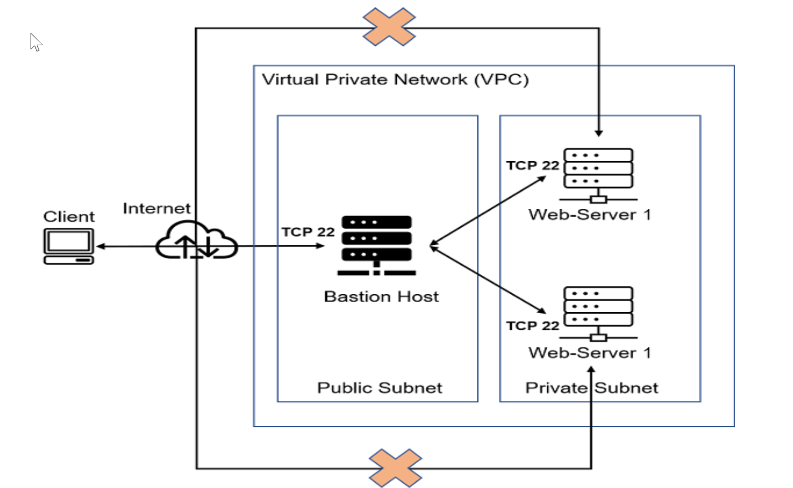

How to Install and Configure Ansible Client to act as a Jump Server/Bastion Host and Create a simple Ansible Playbook to automate server configuration

Prerequistes :

1. NFS Server
2. Web Server 1
3. Web Server 2
4. Load Balancer
5. Database Server
6. Jenkins Server

The following steps are taken to install and configure Ansible Client as a Jump Server/Bastion Host and create a simple Ansible Playbook to automate server configuration:

# Step 1: Install and Configure Ansible on an EC2 Instance

* Create a new repository called ansible-config-mgt in your GitHub account.

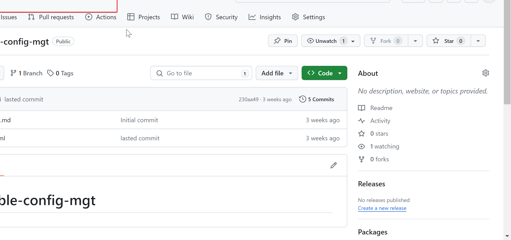

Update the Name tag on your Jenkins EC2 Instance to Jenkins-Ansible. This server will be used to run playbooks.

* Install Ansible on the `Jenkins-Ansible` server.

`sudo apt update && sudo apt install ansible -y`

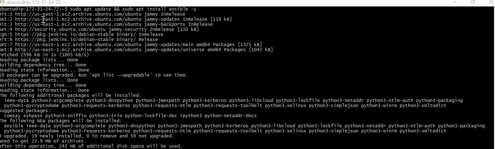

* Check the version of Ansible running on your instance by running the following command:

`ansible --version` 

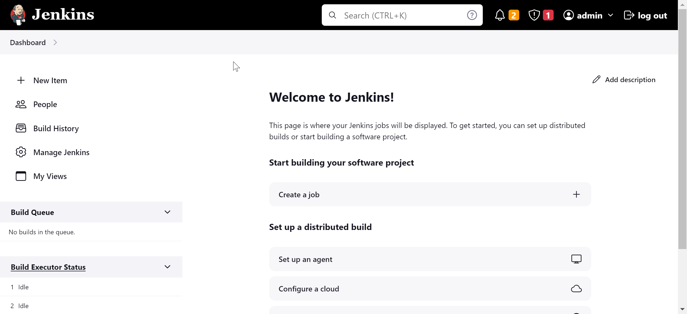

# Step 2: Configure Jenkins Build Job to archive your repository every time changes are made

* Log into Jenkins.

`http://public_ip_jenkins_ansible_instance:8080`

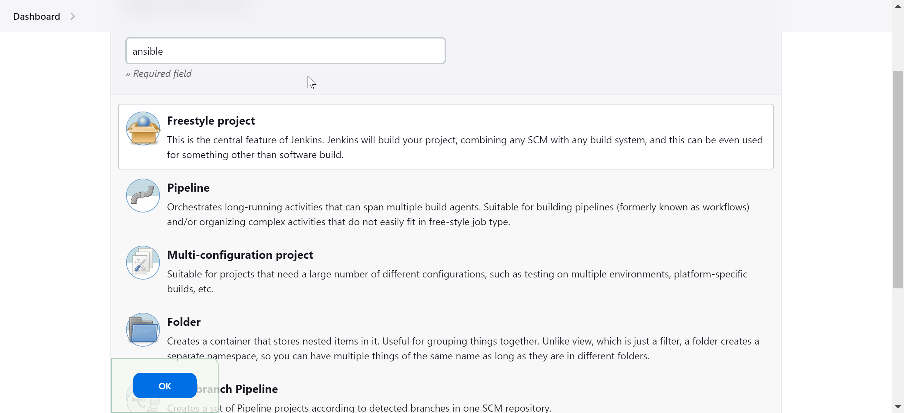

* Create a new Freestyle Job called ansible, select discard old builds then give it a maximum of 2 builds to keep and point it to your `ansible-config-mgt repository`.

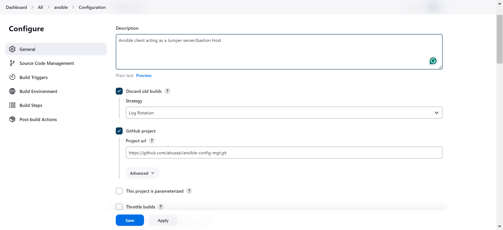

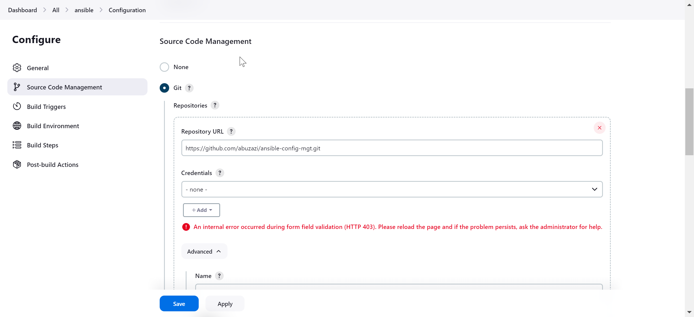

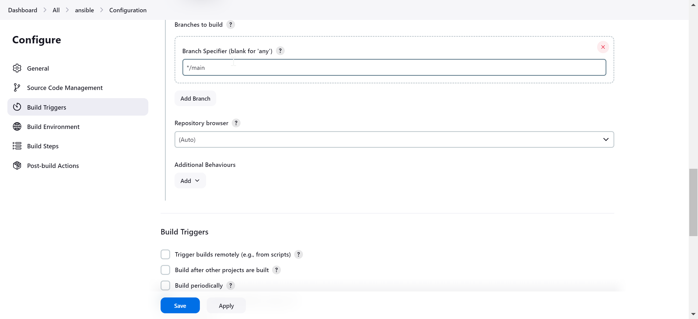

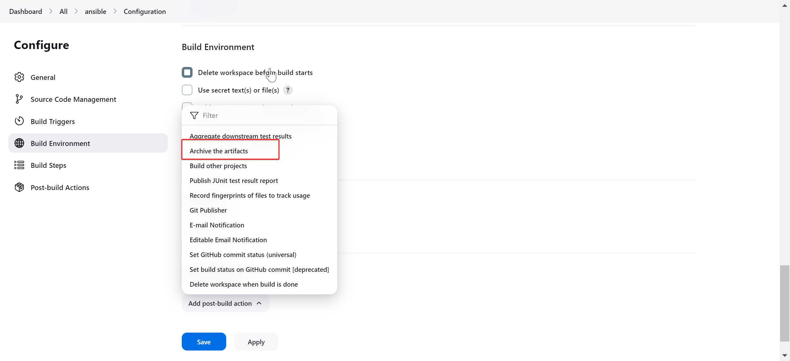

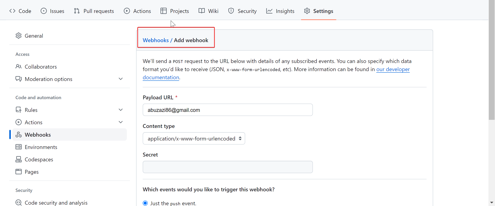

* Select GitHub hook trigger for GitScm polling and configure a Post-Build Job (i.e. Archive the artifacts) to save all ** files then click on apply and save.

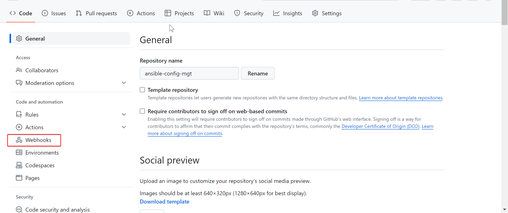

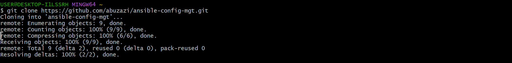

# Step 4: Prepare your development environment using Visual Studio Code
* Download and install VS Code

* After successfully installing VS Code, configure it to connect to your newly created GitHub repository.

* Clone down the ansible-config-mgt repository to your local machine.

* git clone <ansible-config-mgt-repository-link>

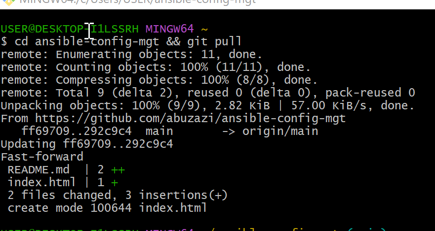

    - Go into the ansible-config-mgt directory and pull the repo to ensure the directory is up to date.

    - `cd ansible-config-mgt && git pull`

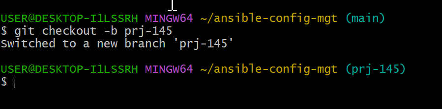

# Step 5: Begin Ansible development and Set up an Ansible Inventory

* Create a new branch in the ansible-config-mgt repository that will be used for the development of a new feature using the command shown below:

* git checkout -b prj-145

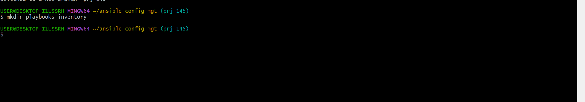

* Create a playbooks (i.e. used to store all the playbook files) and inventory (i.e. used to keep your hosts organized) directory.

`mkdir playbooks inventory`

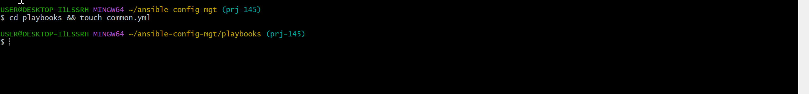

* Create your first playbook named common.yml in the playbooks directory.

`cd playbooks && touch common.yml`

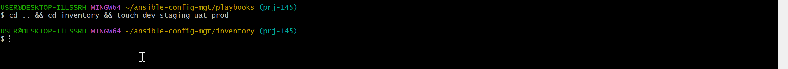

* Create inventory files for each environment (i.e. Development, Staging, Testing and Production) in the inventory directory.

`cd .. && cd inventory && touch dev staging uat prod`


An Ansible inventory file defines the hosts and groups of hosts upon which commands, modules and tasks in a playbook operate. Since we intend to execute Linux commands on remote hosts and ensure that it is the intended configuration particular server that occurs. It is important to have a way to organize our hosts in such an Inventory.

*      To confirm that the key has been added.
`eval ssh-agent -s`

`ssh-add <path-to-private-key>`

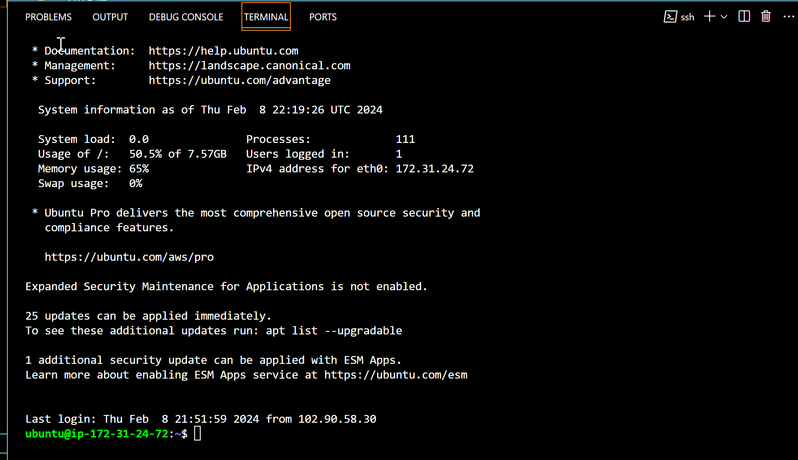

To ssh into `Ansible-jenkins` server using ssh agent

`ssh -A ubuntu@public-ip`

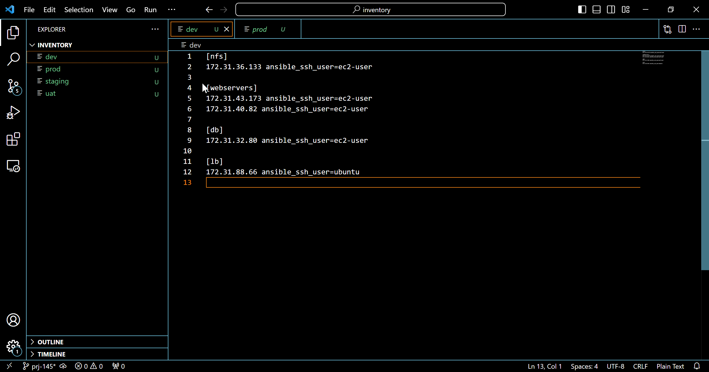

Update your inventory/dev.yml file with the code shown below:

``` bash
[nfs]
<NFS-Server-Private-IP-Address> ansible_ssh_user='ec2-user'

[webservers]
<Web-Server1-Private-IP-Address> ansible_ssh_user='ec2-user'
<Web-Server2-Private-IP-Address> ansible_ssh_user='ec2-user'

[db]
<Database-Private-IP-Address> ansible_ssh_user='ec2-user' 

[lb]
<Load-Balancer-Private-IP-Address> ansible_ssh_user='ubuntu'

```

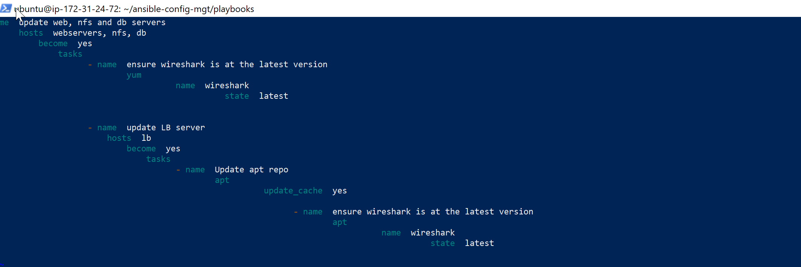

# Step 8: Create a common playbook

*   It is time to start giving Ansible the instructions on what you need to perform on all servers listen in inventory/dev. In the common.yml playbook, you will write configurations for repeatable, reusable and multi-machine tasks that are common to systems with the infrastructure.

Update your playbooks/common.yml file with the following code:

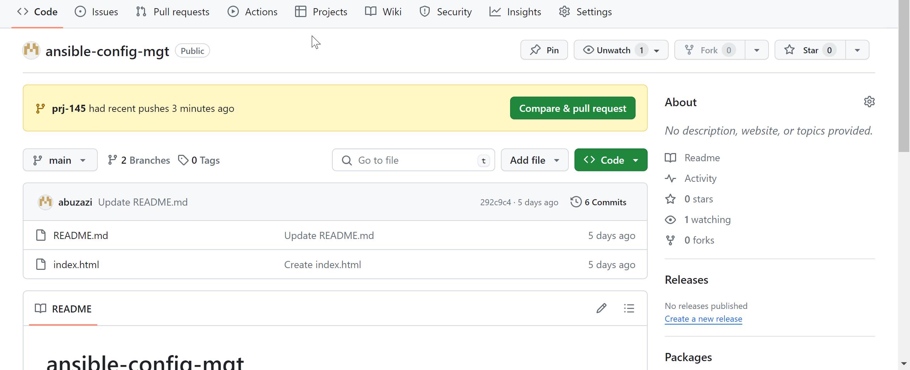

The code above has two plays, the first play is dedicated to the RHEL Servers (i.e. NFS, Database, Web). The task will be performed as the root user hence the use of the become: yes key value pair. Since they are all RHEL Based Servers, the yum module is used to install wireshark and finally the state: latest key-value pair is used to specify that the wireshark installed is the latest version.

The second play is dedicated to the Ubuntu Server (i.e. Load Balancer), it has two tasks: The first task is used to update the server. The update_cahce is similar to apt update and the second task is used to download the latest version of wireshark using the apt module.

# Step 9: Update GIT with the latest code

Now that all of your directories and files live on your local machine, you need to push changes made locally to GitHub. Remember you have been working on a separate branch prj-145, you need to get your branch peer-reviewed and pushed to the main branch. The following steps are taken to achieve this:

* Use the following commands to check the status of your branch, add files and directories then commit changes and push your branch to GitHub:

* Go to your `ansible-config-mgt` repository on GitHub and click on the Compare & pull request button. 

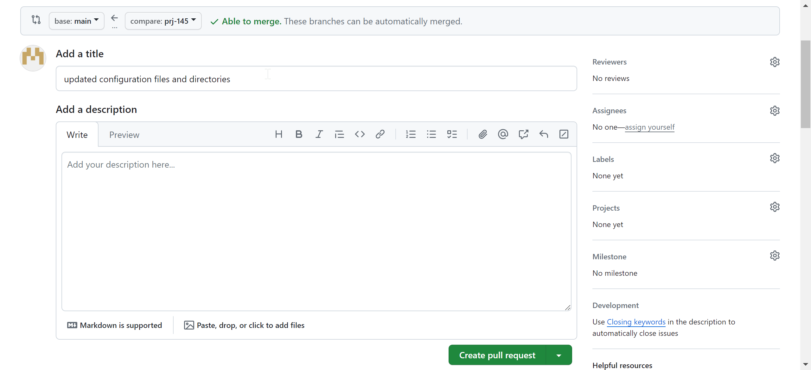

* Click on the Create pull request button.

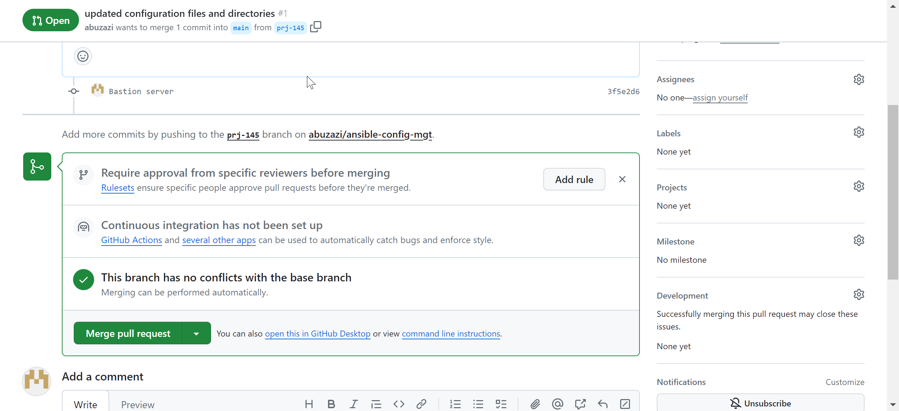

* Click on the Merge pull request button and confirm 

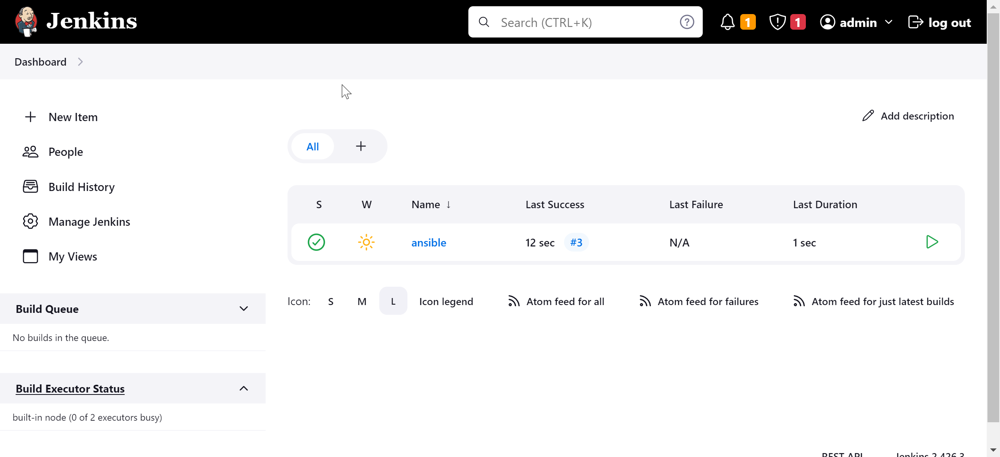

* Head back to your terminal on VS Code, checkout from prj-145 branch into the main and pull down the latest changes using the commands shown below:

* `git checkout main && git pull`

Once your code changes appear on the main branch, Jenkins will be triggered to do the ansible job and save all the files (i.e. build artifacts).

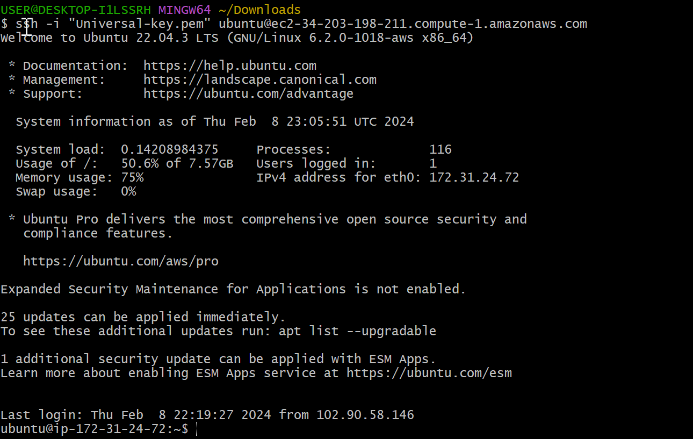

# Step 10: Run the first Ansible test

* SSH into the Jenkins-Ansible server.

`ssh ubuntu@public_ip_address_of_jenkins_ansible`

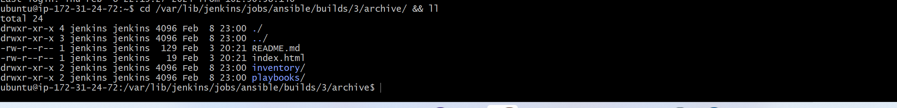

The build artifacts are saved in the `/var/lib/jenkins/jobs/ansible/builds/<build_number>/archive/`  directory on the server.

`cd /var/lib/jenkins/jobs/ansible/builds/<build_number>/archive/ && ll`

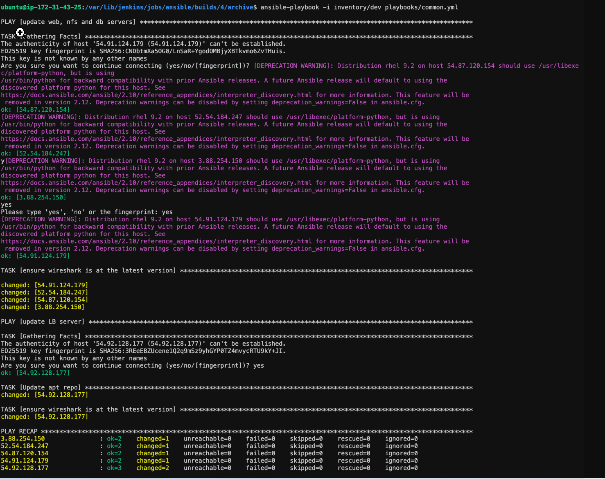

* Run the following command to run the Ansible Playbook.

* ansible-playbook -i inventory/dev playbooks/common.yml

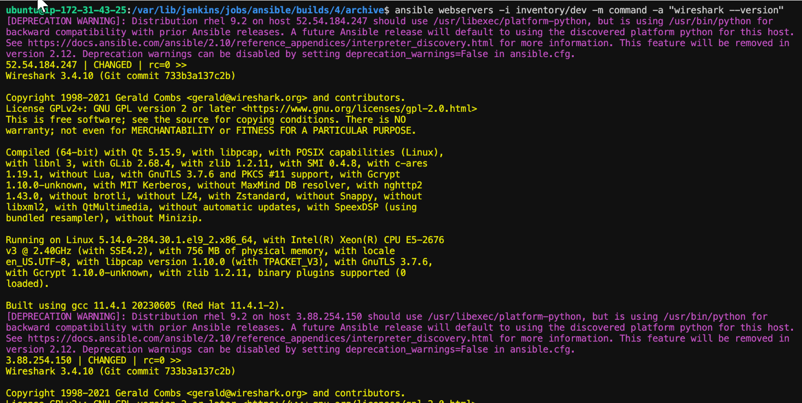

* Use the Ansible Adhoc command to check if wireshark has been installed on the servers.

* `ansible webservers -i inventory/dev -m command -a "wireshark --version"`


* `ansible nfs,db -i inventory/dev -m command -a "wireshark --version"`

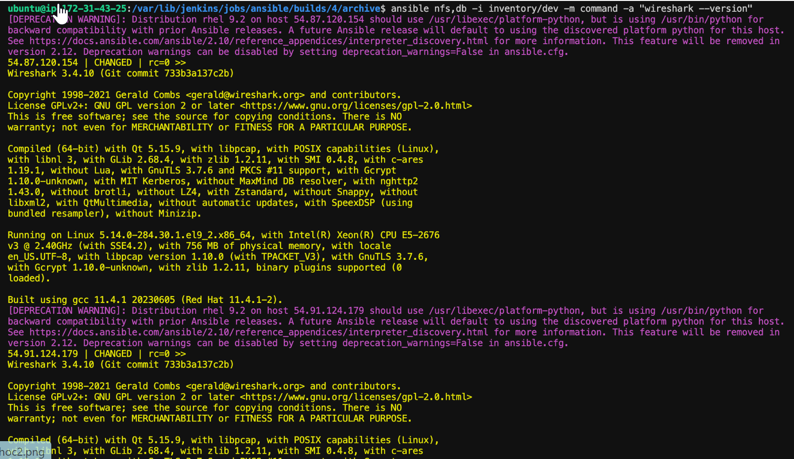

* `ansible lb -i inventory/dev -m command -a "wireshark --version"`

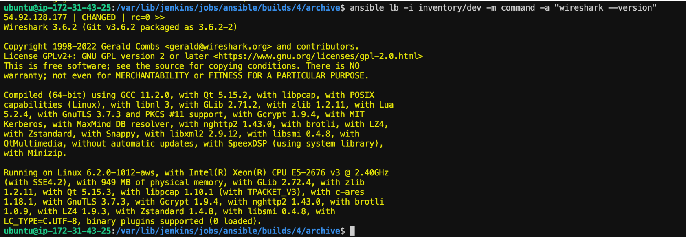

The final set up looks like this : 

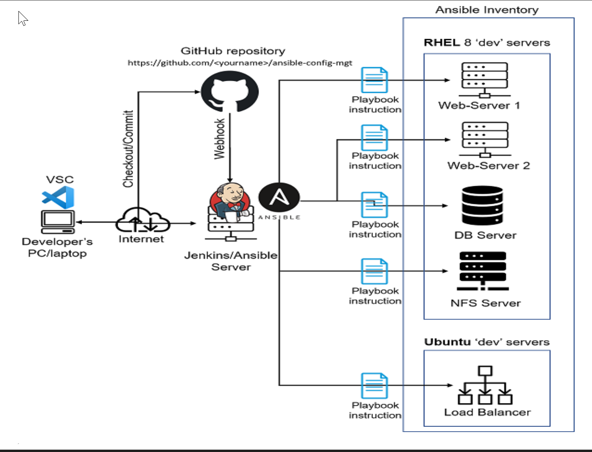