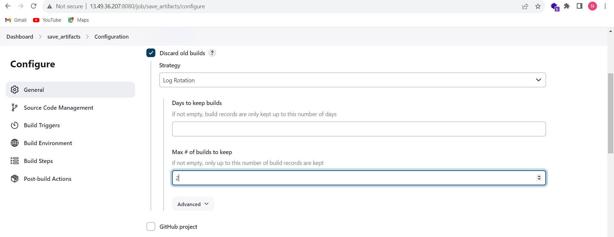
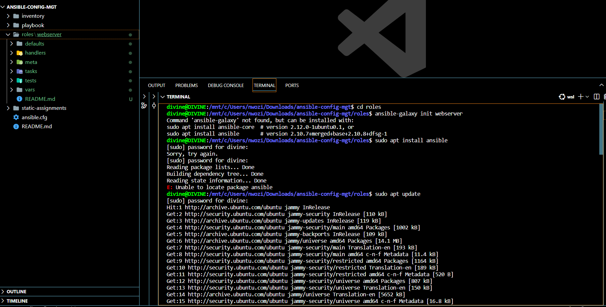
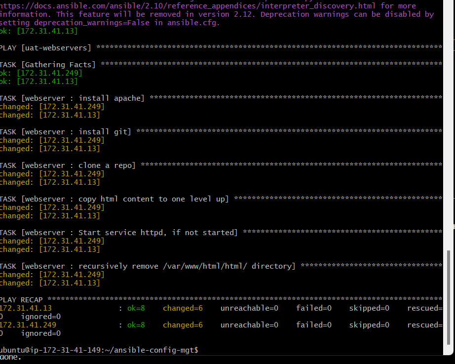
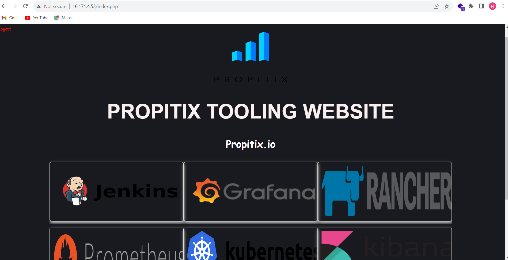

# ANSIBLE REFACTORING PROJECT DOCUMENTATION

### AIM
The purpose of this project is to improve on the code arragement, readibility and scalabilit of project 11 and creating a path to save all artifact in other to decloud our jenkins server from getting conjested.

## Step 1: Setting up the server 

* Note that i am continuing the project with my ansible-jenkins server used in project which already has ansible and jenkins running.

* On the home directory a folder called "ansible-config-artifact" was created to save all artifacts and permission was given so that ubuntu can use the folder

    `sudo mkdir ansible-config-artifact chmod -R 0777 /home/ubuntu/ansible-config-antifact` 

    

* log into my jenkins web console to install a plugins called "copy artifacts" without restarting jenkins on this path manage jenkins>>plugins>>tab search for "copy artifact"

    

    

* I already have a project called ansible on jenkins so it will act as my upstream project to trigger a downstream project so that whenever i run a build on the project it will triger a buld on the downstream project hence i created a new free style project called save_artifacts to saerve as my downstrem project

* However this folder; save_artifacts was located on a this path /var/lib/jenkins/workspace but i have to move it to the home directory of ubuntu to acchieve te aim.
 
* I configured the save_artifacts project

    

    

    

    

    

    

## Step 2: Refactoring by importing other playbooks

* I created a new branch called refactor where all my work be done before merging to the main brain. in real time production the refactor branch is the only enviroment where i am permited to make changes and then make a pull request for my code to be checked and approved befor been merged to the main branch which is like the production enviroment.

    `git checkout refactor`

* I touched a new file on my playbook called site.yml

    `touch site.yml`

*   I created a new folder in root of the repository called "static-assignments" and then moved my common.yml file that contain the code for project 11 into this static-assignments folder

       `sudo mkdir static-assignments`

       `sudo mv common.yml a/nsible-config-mgt/static-assignments`

* Inside site.yml i imported common.yml

    

    

    

* I created another file inside static-assignments folder(because its met to hold all other playbooks) called common-del.yml to carry the codes to delete wireshark that was installed in my server in project 11

* I updated the site.yml file with the new file common-del.yml instaed of common.yml and git add . ,git commit -m, git push and merge and on my server cd into ansible-config-mgt on the home diretory and git pull to bring all my changes to the production line and ran the playbook against dev (the file with the target server IPs)

    `touch common-del.yml`

    

 
    

    

## Step 3: Configuring UAT wedservers with a role webserver

* I  already have two reheart servers from project 11 so i did not need to provision new ones so onle copy their private IPs into my inventory/uat.yml

* On my local system on the ansible-config-mg path, i made a directory called roles and cd into it and because my system is a windows system and i dont have ansible installed in it , i therefore install ubuntu-wsl so i can install ansible in my local system in other to run the 'ansible-galaxy init webserver' command

* To install ubuntu-wsl ran wsl --intsall on my sytem powershell enviroment as admin

* I restarted my local system

* The ansible-galaxy init webserver created under the roles directories with it depencies folders/files

* I configured my `sudo vi /etc/ansible/ansible.cfg`

* to state the path of the roles inventory and disable ssh_key_checking

* on the role websever path, there is a folder called task with a file caled main.yml which i used o write the logic or code to install apache and fork the tooling file. i have forked the tooling repo to my git hub account in an earlier project

    

    

    

    

    

    

    

* All git push and pull was succefully don and the playbook ran successfully 

    

    

## Step 5: To confirm if the tooling interface shows if the public ip of my servers are ran on the web/index.php

   

   