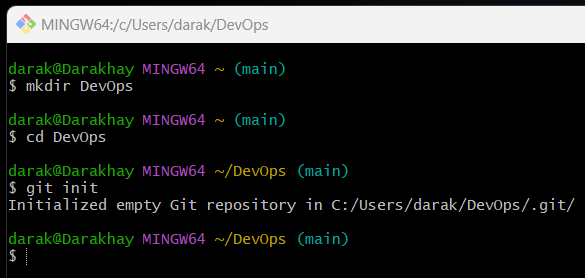
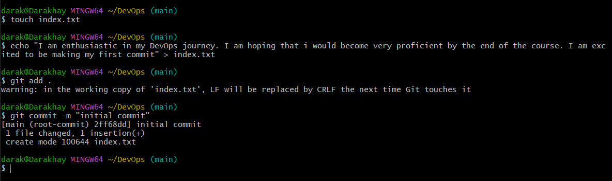
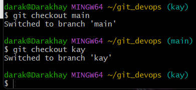
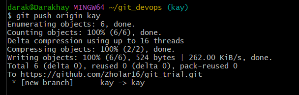
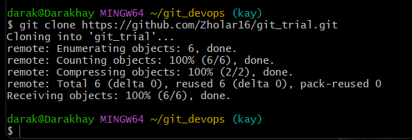

# Initializing a git repository

## _First i created a directory with the 'mkdir' command. i changed the directory to the new folder using the 'cd' command. I used the 'git init' to initialize the repository_

# Making my first commit

## I made my first commit using the following step:
- I created a file using 'touch index.txt'
- I added a text using the 'echo' command
- I used the following command to commit the files 'git add .' and 'git commit -m'

# First git branch

i used the command 'git checkout -b' to create the new branch

# Listing branch

I used 'git branch' to list the branches

# Changing into an old branch

I used 'git checkout -b zholar' 

# Merging branches

# Deleting branch

# Pushing local repository into gitHub

i added the remote repository to github using the command 'git remote add origin https://github.com/Zholar16/git_trial.git'

I pushed using the command 'git push origin kay'

# Cloning

# Branch Management and tagging

1. Headings

# I LOVE DEVOPS
## I LOVE DEVOPS
### I LOVE DEVOPS

2. Emphasis

*DevOps* or _DevOps_
**LOVE DEVOPS** or __LOVE DEVOPS__

3. Lists 

Unordered
- Item 1
- Item 2
- Item 3

Ordered
1. First item
2. Second item
3. Third item

4. Links

[visit darey.io](https://www.darey.io)

5. Images

6. Code

`console.log('Welcome to darey.io')`

