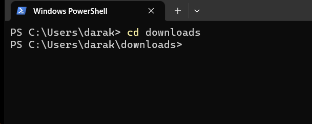
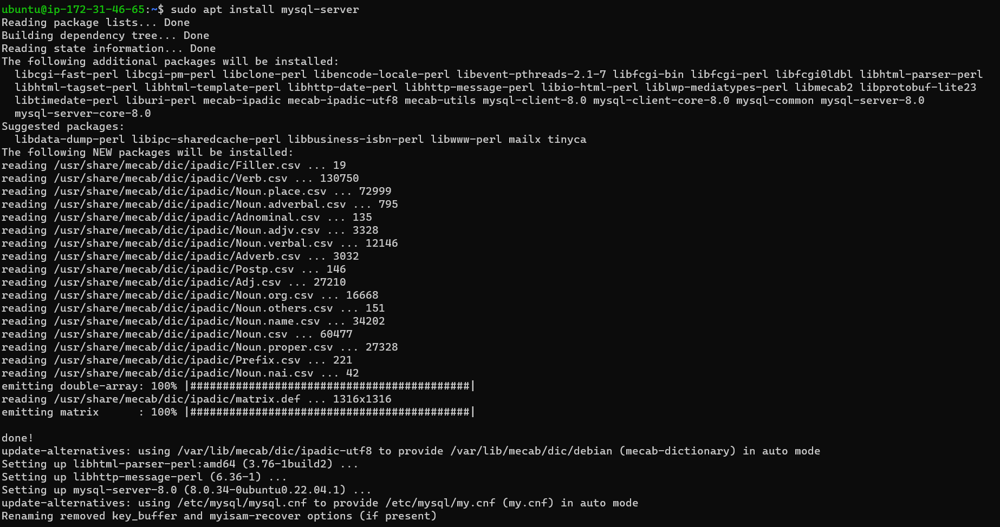
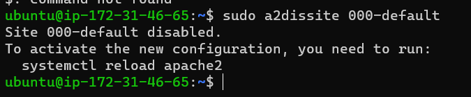

# LAMPSTACK IMPLEMENTATION PROJECT

## What is a LAMPSTACK

A LAMP stack is a bundle of four different software technologies that developers use to build websites and web applications. LAMP stands for Linux, Apache, MySQL, and PHP. Together, they provide a proven set of software for delivering high-performance web applications. Each component contributes essential capabilities to the stack:

Linux: The operating system. Linux is a free and open source operating system (OS) that has been around since the mid-1990s. 

Apache: The web server. The Apache web server processes requests and serves up web assets via HTTP so that the application is accessible to anyone in the public domain over a simple web URL.

MySQL: The database. MySQL is an open source relational database management system for storing application data. 

PHP: The programming language. The PHP open source scripting language works with Apache to help you create dynamic web pages. 
LAMP has a classic layered architecture, with Linux at the lowest level. The next layer is Apache and MySQL, followed by PHP. Although PHP is nominally at the top or presentation layer, the PHP component sits inside Apache.

## What is a Stack

A technological stack is a set of frameworks, libraries and tools used to develop a Software Application. These include : LAMP STACK, LEMP STACK, MEAN STACK AND MERN STACK.

## Prerequisites for LAMPSTACK Implementation

The prerequisites for this project includes:
- An AWS free tier account
- EC2 instance running on a virtual machine
- Ubuntu server

## STEP 1 - Setting up an AWS account

- I registered and opened and AWS account as shown below:

- I created an access key called LampStack_keys, which was subsequently downloaded in the downloads folder

## STEP 2 - Connecting to AWS Instance

- I clicked on the instance name and the connect tab on the AWS management console

- I connected the AWS virtual machine to the local machine via ssh protocol

- I connected to the instance by running 

## INSTALLING APACHE AND UPDATING FIREWALLS

- STEP 1 - Installing Apache

Apache is a free and open-source software that allows users to deploy their websites on the internet. It is one of the oldest and most reliable web server software maintained by the Apache Software

1. I run `sudo apt update`

2. I run apache2 package installation using the command `sudo apt install apache2`

 3.  Verify apache package installation using the command `sudo systemctl status apache2`

 

 4. To receive traffic from web server, i opened TCP port 80

.png>)

5. To access Apache server via local machine, i run the command `curl http://localhost:80`

6. To know how Apache Http server responds to internet request, i run `http://54.242.232.98:80`

7. To retrieve Ip address without using AWS management console

## INSTALLING MySQL

MySQL is an open-source relational database management system and is the third layer of the LAMP stack. The LAMP model uses MySQL for storing, managing, and querying information in relational databases.

- To install mysql database server, i run 'sudo apt install mysql-server'

- To log into mysql consol, i run a command `sudo mysql`

- To set password for root user, i run a command `ALTER USER root @ localhost IDENTIFIED WITH mysql_native_password BY 'PassWord.1';`

To exit mysql shell, i run `'exit'`

## Starting an interactive script

- To start an interactive script, i ran `secure mysql_secure_installation`

- I confirmed password for mysql root user and change from anonymous user

- I run `sudo mysql -p` to test log into mysql

## Installing PHP

PHP is an acronym for "PHP: Hypertext Preprocessor". PHP is a widely-used, open source scripting language. PHP scripts are executed on the server. PHP is free to download and use.

The installation will follow three steps:
1. i would first install PHP-MYSQL to allow php communicate with mysql
2. I would install libapache2-mod-php to enable apache handle php files
3. Install PHp packages with its dependencies

- To install the php-mysql, libapache2-mod-php and php package, i ran the command 'sudo apt install php libapache2-mod-php php-mysql'

- I run `php -v` to confirm the pHP version

## Enabling PHP on the website

To enable PHP, the index.html will take precendence over index.php

- To change this behaviour, i'll need to edit the /etc/apache2/mods-enabled/dir.conf

- I would change the order in which index.php file is listed within the directory index by running the command `sudo vim /etc/apache2/mods-enabled/dir.conf`

- I copied the following into the text

<IfModule mod_dir.c>
        #Change this:
        #DirectoryIndex index.html index.cgi index.pl index.php index.xhtml index.htm
        #To this:
        DirectoryIndex index.php index.html index.cgi index.pl index.xhtml index.htm
</IfModule>

- I reloaded apache2 to effect changes by running the command `sudo systemctl reload apache2`

- To create a script to test if PHP is correctly installed in the server, i created a file named 'index.php'. I run a command `vim /var/www/projectlamp/index.php`

- I added the text below inside the file, which is a valid PHP code

- To remove the PHP page to avoid losing sensitive datas, i run a `sudo rm /var/www/projectlamp/index.php`

# To create a virtual host for the website using Apache

- I created a directory for 'projectlamp' using `sudo mkdir /var/www/projectlamp`

- I assigned ownership of the directory using the command: `sudo chown -R $USER:$USER /var/www/projectlamp`

- I created and opened a new configuration file in Apache by running the command ` sudo vi /etc/apache2/sites-available/projectlamp.conf` 

- A new file was created and i inserted the following:

<VirtualHost *:80>
    ServerName projectlamp
    ServerAlias www.projectlamp 
    ServerAdmin webmaster@localhost
    DocumentRoot /var/www/projectlamp
    ErrorLog ${APACHE_LOG_DIR}/error.log
    CustomLog ${APACHE_LOG_DIR}/access.log combined
</VirtualHost>

- To show the new files in site available directory, i run the command `sudo ls /etc/apache2/sites-available`

- To enable a new virtual host, i run a command `sudo a2ensite projectlamp`

- To disable apache default page and stop it from overriding virtual host, i run the command `sudo a2dissite 000-default`.

- I reloaded apache using 'sudo systemctl reload apache2'

I created a html file in the web root directory /var/www/mylampproject to test if the virtual host work as expected and then ran a command 'sudo echo 'Hello LAMP from hostname' $(curl -s http://169.254.169.254/latest/meta-data/public-hostname) 'with public IP' $(curl -s http://169.254.169.254/latest/meta-data/public-ipv4) > /var/www/projectlamp/index.html'

