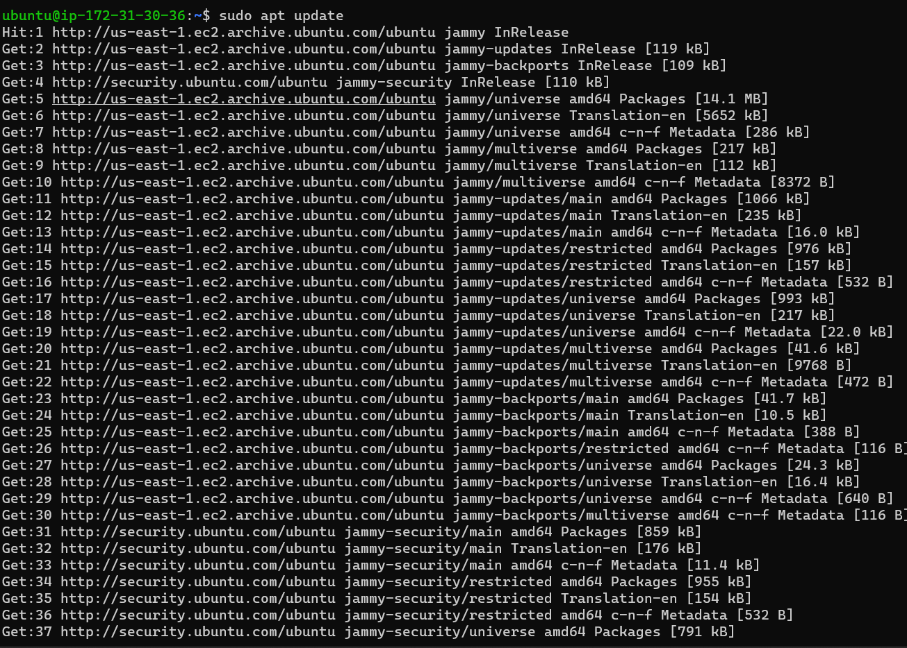

# Web Stack Implementation (Lemp Stack)

What is LEMP stack?

LEMP is an open source web application stack used to develop web applications. The term LEMP is an acronym that represents L for the Linux Operating System, Nginx (pronounced as engine-x) webserver, M for MySQL database, and P for PHP scripting language.

LEMP enjoys good community support and is used around the world in many highly scaled web applications. Nginx is the second most widely used web server in the world following apache.

# PREREQUISITES

* An AWS free tier account

* An EC2 instance running on a virtual machine

* Ubuntu server OS running

I launched my terminal and connected to the AWS EC2 instance

Step 0: I changed directory using `cd Downloads` and  I run the command `ssh -i "webstack_key.pem" ubuntu@ec2-54-237-71-35.compute-1.amazonaws.com` to connect to my already created instance

## Installing the Nginx Web Server
Step 1: 
I run the following commands to install the Nginx web server 

`sudo apt update`

`sudo apt install nginx`

I used the command `sudo systemctl status nginx` to verify that Nginx was succesfully installed and running as a service in Ubuntu

I run the command `curl http://localhost:80` to assess it locally in my ubuntu shell

I used http://54.237.71.35:80 to verify that it was correctly installed and accessible through firewall

## Installing MySQL

Step 2 - Installing mySQL

i run the command `sudo apt install mysql-server` and i logged into the server using `sudo mysql`

I run a security script setting a password for the root user with the command `ALTER USER 'root'@'localhost' IDENTIFIED WITH mysql_native_password BY 'PassWord.1';
`

`sudo mysql_secure_installation`

`sudo mysql -p`

## Installing PHP

**PHP help to generate code and process dynamic web content for the web server**

Unliek apache2 that has PHP interpreter embedded in each request, Nginx requires an additional program to handle PHP processing and act as a bridge between the PHP interpreter itself and web server

* First we need to install `php-fpm (php fast CGI process managee)` and ask Nginx to pass request to the software for processing

* Secondly, install `php mysql`

Step 3 - Installing PHP

`sudo apt install php-fpm php-mysql`

## Configuring Nginx to Use PHP Processor

When using the Nginx web server, we can create server blocks (similar to virtual hosts in apache) to encapsulate configuration details and host more than one domain on a single server. We will use `projectLEMP` as an example domain name.

On ubuntu 20.04, Nginx has one server block enabled by default and is configured to serve documents out of a directory at /var/www/html. While this works well for a a single site, it can become difficult to manage if you are hosting multiple sites. Instead of modifying `var/www.html`, we'll create a directory structure within `/var/www` for the domain website leaving `/var/www/html` in place as the default directory to be served if a client request does not match any other sites. 

1. I created a root web directyory for my domain using the command

`sudo mkdir /var/www/projectLEMP`

2. I assigned ownership of the directory with the $USER environment variable:

`sudo chown -R $USER:$USER /var/www/projectLEMP`

3. I opened a new configuration file in Nginx's directory using the nano command as follows and i copied and pasted the prescribed text.

`sudo nano /etc/nginx/sites-available/projectLEMP`

4. I activated the configuration by linking to the config file from Nginx's directory using the command:

`sudo ln -s /etc/nginx/sites-available/projectLEMP /etc/nginx/sites-enabled/`

5. I tested the configuration for syntax errors using the command:

`sudo nginx -t`

6. I reloaded Nginx to apply the changes:

`sudo systemctl reload nginx`

7. I created an index.html file in that location and tested how the new server block works:

`sudo echo 'Hello LEMP from hostname' $(curl -s http://169.254.169.254/latest/meta-data/public-hostname) 'with public IP' $(curl -s http://169.254.169.254/latest/meta-data/public-ipv4) > /var/www/projectLEMP/index.html`

http://54.237.71.35:80

## Testing PHP with Nginx

After setting up the LEMP stack. I created a test PHP file document rooot in my text editor using the command 

`nano /var/www/projectLEMP/info.php`

I copied and pasted the prescribed PHP code

I was able to access this page using the link below

http://54.237.71.35/info.php

## Retrieving data from MySQL database with PHP
 Step 6 - Retrieving data from MySQL database with PHP

 1. I connected mySQL console to the root account using the command `sudo mysql`

 2. I created a new database from mySQL console

 3. I created a new user named example_user

 4. I granted permission over the example database

 5. I exited the comnsole

 6. I tested by logging into the MySQL console again with the custom credentials `mysql -u example_user -p`

7. I accessed the database usning SHOW DATABASES;

8. I created and edited the table using the mySQL console

9. I created a PHP script that connected to MySQL and i queried the content using the command: `nano /var/www/projectLEMP/todo_list.php`

10. I copied the prescribed text into the todo_list.php 

11. I accessed this page in the web browser and got this

http://54.237.71.35/todo_list.php

