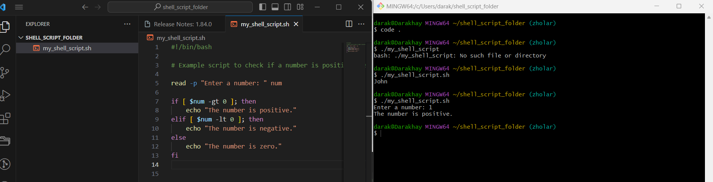

# INTRODUCTION TO SHELL SCRIPTING AND USER INPUT 

## What is a shell?

A shell is a special user program that provides an interface for the user to use operating system services. Shell accepts human-readable commands from users and converts them into something which the kernel can understand. It is a command language interpreter that executes commands read from input devices such as keyboards or from files. The shell gets started when the user logs in or starts the terminal

### What is shell scripting

Usually, shells are interactive, which means they accept commands as input from users and execute them. However, sometimes we want to execute a bunch of commands routinely, so we have to type in all commands each time in the terminal.

As a shell can also take commands as input from file, we can write these commands in a file and can execute them in shell to avoid this repetitive work. These files are called Shell Scripts or Shell Programs. Shell scripts are similar to the batch file in MS-DOS. Each shell script is saved with .sh file extension e.g., myscript.sh.

A shell script has syntax just like any other programming language. If you have any prior experience with any programming language like Python, C/C++ etc. It would be very easy to get started with it.

A shell script comprises the following elements –

Shell Keywords – if, else, break etc.

Shell commands – cd, ls, echo, pwd, touch etc.

Functions :

Control flow – if..then..else, case and shell loops etc.

## Shell Scripting Syntax Elements

Variables : Bash allows you define work and work with variables.

Variable can store data of various type such as numbers, string, and array. You can assign values to variables using operators(=).And access their values using variable name preceded by a $ Sign.

* To create a default shell script
    
    + I run the command `touch my_shell_script.sh`

    

* To view the my_shell_script.sh
  
    + I run the `ls my_shell_script.sh` and opened with a code editor using `code .`  

    

* I created an executable file of the my_shell_script file using the command `chmod +x my_shell_script.sh`

* I used the command `./my_shell_script_file.sh` to run the file

* I started the script with a declaration `#! /bin/bash`

* I assiged values to variables, used `echo $name` to retrieve the value and saved the file

     

* I got the result displayed below after running the script

     

## Control Flow Statement

Bash provides a control flow statement like if-else, for loops, while loops and case statement to control the flow of execution in your scripts. These statements allows you to make a decision,iterates over lists, and execute different commands based on conditions.

1. I used `if-else` to execute a given script based on condition and i got the result displayed in the image below

      

2. Iterating through a loop: I executed the given script and got the result below:

     

3. Command line substitution: Allows me to capture the output of a command and use it as a value within my script. 
   
    * Using backtick - I run the given script and got the result below:

     

    * Using syntax - I run the given script and got the result below:

    

4. Input and Output: Bash provides various ways to handle inputs and Output. ,you can use the read command to accept user input,and output text through the console using the echo command. Additionally you can redict input and output using operators

     * Accept user input: I run the given command and got the result shown below

    

     * Output text to terminal: I run the given command and got the result shown below

    

    * Output the result of a command into a file: I run the given command and got the result shown below

     

     * Pass the result of a command into another command: I run the given command and got the result shown below

     

5. Functions: Bash allows you to define and use functions to group related commands together.functions provides a way to modularize your code and make it more reusable. you can define function using the function keyword or simply by declaring the function name followed by parenthesis.

     * I defined function to greet a user with this script show below:

     

 ## Writing a Shell Script

1.  I created a folder called _shell-scripting_ using the command `mkdir shell-scripting`

2. I created a file called _user-input.sh_ using the command `touch user-input.sh`

3. I copied amd pasted a block of code

4. I saved the file

5. I run the command `sudo chmod +x user-input.sh` to make the file executable

6. I run the script using the command `./user-input.sh`

## Directory Manipulation and Navigation

To write a script that will display the current directory, create a new directory called "my_directory"change to that directory, create two new files inside it, list the files and move back one level up,remove the "my_directory" and its contents and finally list the file in the current directory.

* I opened a file with the command `touch navigating-linux-filesystem.sh`

* I opened with code editor `code .`, pasted the given code and saved it

* I made the file executable by running the command `chmod +x navigating-linux-filesystem.sh`

*I run the script `./navigating-linux-filesystem.sh`
    

## File Operation and Sorting

To write a script that can create three files(file1.txt,file2.txt and file3.txt),display the file in their current order, sort them alphabetically,save the sorted files in the (sorted_files.txt) display the sorted files,removes the original files,rename the sorted files to sorted_files_sorted_alphabetically.txt and finally display the content of the final sorted files.

* I opened a file by running `touch sorting.sh`

* I opened the file using `code .`, copied and pasted the code

* I made the file executable by running the command `chmod +x sorting.sh`

* I run the script `./sorting.sh`

    

## Working with Numbers and Calculations

To write a script that defines two variables num1 and num2, with numeric values, perform basic arithmethic operations (addition,subtraction,multiplication,division and modules) and display its results. it also perform more complex operation such as raising numb1 to power 2 and calculatin the square root of num2, and display those results as well.

* I opened a file by running `touch calculations.sh`

* I opened the file using `code .`, copied and pasted the code

* I made the file executable by running the command `chmod +x calculations.sh`

* I run the script `./calculations.sh`

    

## File Backup and TimeStamping

This script defines source directory and backup directory paths. it then create timestamps using the current date and time,and create a backup directory with the timestamp appended to its name. The script then copies all files from the source directory to the backup directory using the cp command with -r option for recursive coping. Finally,it displays a message indicating the completion of the backup process and shows the path of the backup directory with the timestamp

* I opened a file by running `touch backup.sh`

* I opened the file using `code .`, copied and pasted the code

* I made the file executable by running the command `chmod +x backup.sh`

* I run the script `./backup.sh`

      
