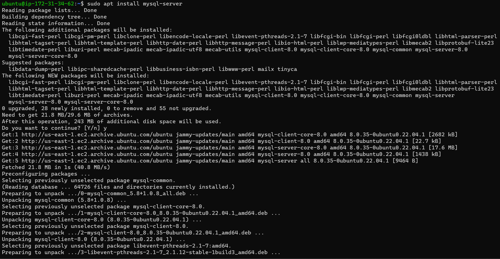

# UNDERSTANDING CLIENT-SERVER ARCHITECTURE

## Client Server Architecture with MySQL

### What is Client-server architecture?

Client-server refers to an architecture in which two or more computers are connected over a network to send and receive request s between one and another.

In their communication, each machine has its own role : The machine sending the request is referred to as the __CLIENT__ and the machine responding (serving) is referred to as the __SERVER__.

# IMPLEMENTING CLIENT-SERVER ARCHITECTURE USING MYSQL DATABASE MANAGEMENT SYSTEM

## To demonstrate basic client-server using MySQL RDBMS

### To create and configure two linux based virtual servers (EC2 instances on AWS)

* I created two EC2 instances and named them as follows:

          Server 1: MySQL-server (to serve information)

          server 2: MySQL-client (to request information)

 

* I connected the two EC2 instances created to the terminal using the command `ssh -i webstack_key.pem ubuntu@ec2-3-84-228-216.compute-1.amazonaws.com` for both client and server

* I run the command `sudo apt update` to update both servers

* i run the command `sudo apt install mysql-server` to install MySQL server

* I run the command `sudo apt install mysql-client` to install the client server

 __The two EC2 virtual servers are located in the same local virtual network and they can communicate with eachother using local IP address__

* To connect the server and client using local iP address, i changed inbound TCP rule to port 3306 cand connect the client's local IP address

* I configured mySQL-server to allow connection from remote host, in order to connect client to server

     * I run the command `sudo nano /etc/mysql/mysql.conf.d/mysqld.cnf`

     

     

     * I changed the binding address to `0.0.0.0`

     

* To connect mySQL-client to mySQL-server without using SSH:
     
     * I opened mySQL console on mySQL-server

     
     
     * I created a user to be indentified by a password using the command `CREATE USER 'zholar'@'172.31.44.200' IDENTIFIED BY 'PassWord.1';`

     * I granted privileges using the command `GRANT ALL PRIVILEGES ON *.* TO 'zholar'@'172.31.44.200';` 

     * I flushed privileges using the command `FLUSH PRIVILEGES;` and exited

     

     * I restarted mysql using the command `sudo systemctl restart mysql`

* From the client server, i run the command `mysql -u zholar -p -h 172.31.34.62` using the private IP of the server.

     

      

> __END OF PROJECT__
       
