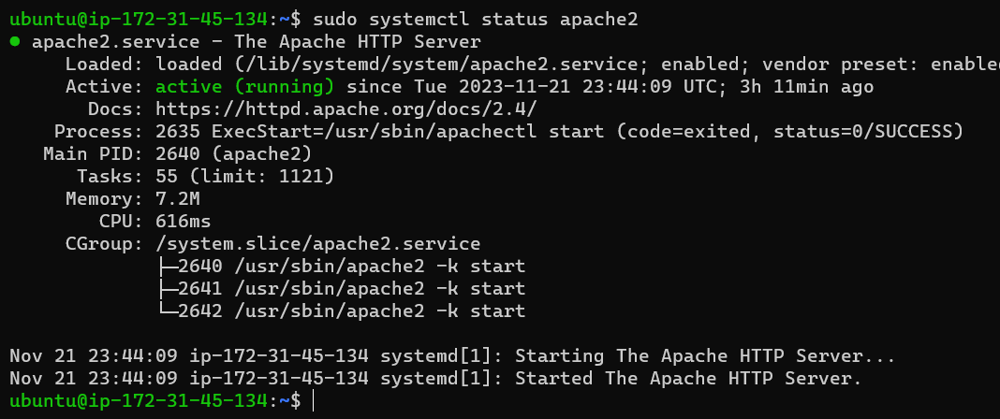
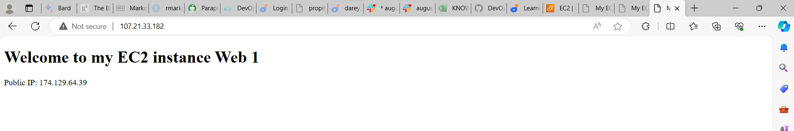

# IMPLEMENTATION OF LOAD BALANCING WITH NGINX

## Introduction to Load Balancing and Nginx

__What is a Load Balancer__

A load balancer distributes workloads across multiple compute resources, such as virtual servers. Using a load balancer increases the availability and fault tolerance of your applications.

You can add and remove compute resources from your load balancer as your needs change, without disrupting the overall flow of requests to your applications.

The load balancer stands in front of the webserver and all traffic gets into it first, it then distribute the traffic evenly across the set of webservers. This ensures no webserver gets overworked,consequently improving performance.

Nginx is a versatile software it acts like a webserver,reverse proxy, and a load balancer etc.All that is needed is to configure it properly to server to your use case.

## Setting Up a BAsic Load Balancer

__Step 1: Provisioning EC2 Instance__

* I opened AWS management console and and clicked on Launch instance

* I provided unique names to ther servers namely: 
    * webserver 1
    * webserver 2
    * loadbalancer

* I clicked on Quick Start and chose Ubuntu under Applications and OS images

* I used an existing key pair `webstack_key`

* Finally, i launched the instance

    

__Step 2: Open port 8000__

* I clicked on instance ID of the unique webservers

* I clicked on security and also clicked on 'Edit inbound rules'.

* I added the new rule (Port 8000) and saved it

    

__Step 3: Installing Apache on both webservers 1 and 2__

* On the terminal, i changed directory using the command `cd downloads` and I connected to the instance via the local machine using SSH with the command `ssh -i "webstack_key.pem" ubuntu@ec2-35-175-254-47.compute-1.amazonaws.com` for both webservers individually

    

    For webserver2

    

* I installed Apache2 on both webservers using the command `sudo apt update -y &&  sudo apt install apache2 -y`

    

    For webserver2

    

* I verified that Apache2 is running using the command `sudo systemctl status apache2`

    

    For webserver2

    

__Step 4: Configuring Apache to serve a page showings its public IP__

* I configured Apache2 to serve content on port 8000
     1. I used text editor nano to open the file >ports.conf using the command `sudo nano /etc/apache2/ports.conf`

     

        For webserver2

    

     2. I added a new listen directive for port 8000 and saved it

        

        For webserver2

        

     3. I opened the 000-default.conf file, changed port 80 on the virtual host to 8000 using the command `sudo vi /etc/apache2/sites-available/000-default.conf`

        

        

        For webserver2

        

     4. I saved and closed the file 

     5. I restarted apache2 on both servers to load the new configuration using the command `sudo systemctl restart apache2`

        

        For webserver2

        

* __Creating my html file__

     1. I opened a new html file using the command `sudo nano index.html` 

        

        For webserver 2

        

     2. I edited the file and tagged the name of the webservers. I also copied the public ip of both webservers and inserted it into the file

        

     3. I changed the file ownership with the command `sudo chown www-data:www-data ./index.html`

        

* __Overriding the Default html file of Apache webserver:__

    1. I replaced the default html file with the new file using the command `sudo cp -f ./index.html /var/www/html/index.html`

        

        For webserver2

        

    2. I restarted the webserver to load the new configuration with the command `sudo systemctl restart apache2`

        

        For webserver2

        

    3. I got this web page result

        

        

__Step 5: Configuring Nginx as a load balancer__

    * I opened a load balancer EC2 instance and made sure port 80 is opened to accept traffic from anywhere

 

    * I SSH into the instance using the command `ssh -i webstack_key.pem ubuntu@107.21.33.182`

 

    * I updated the server and installed Nginx using the command `sudo apt update -y && sudo apt install nginx -y`

 

    * I verified the installation using the command `sudo systemctl status nginx`

    * I opened Nginx configuration file with the command `sudo vi /etc/nginx/conf.d/loadbalancer.conf`

    * I pasted the configurated file below, edited and pasted the correct IP of the webservers and the loadbalancers

            
        upstream backend_servers {

            # your are to replace the public IP and Port to that of your webservers
            server 127.0.0.1:8000; # public IP and port for webserser 1
            server 127.0.0.1:8000; # public IP and port for webserver 2

        }

        server {
            listen 80;
            server_name <your load balancer's public IP addres>; # provide your load balancers public IP address

            location / {
                proxy_pass http://backend_servers;
                proxy_set_header Host $host;
                proxy_set_header X-Real-IP $remote_addr;
                proxy_set_header X-Forwarded-For $proxy_add_x_forwarded_for;
            }
        }
    

    * I used this command to silence the default configuration file `sudo nano nginx.conf`

    

    * I tested the configuration with the command `sudo nginx -t`

    * I restarted Nginx to load the new configuration using the command `sudo systemctl restart nginx`

    * I reloaded the web pages

> END OF PROJECT 